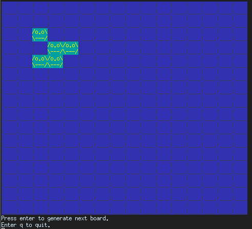

Conway's Game of Life on 2-D toroidal grid in rust.

An interactive command-line experience.

Steps to success:

1. Start program with `cargo run`
2. Select a demo
3. ????
4. PROFIT!!!

My first rust program.  I would really appreciate feedback on idiomatic rust.

You can change the const declaration to adjust the size of the grid.

Author: Lyall Jonathan Di Trapani

Tests
-----

    cargo test

Crate
-----

<https://crates.io/crates/life>

To publish a new version:

    cargo publish

License
-------

Licensed under either of

 * Apache License, Version 2.0
   ([LICENSE-APACHE](LICENSE-APACHE) or http://www.apache.org/licenses/LICENSE-2.0)
 * MIT license ([LICENSE-MIT](LICENSE-MIT) or http://opensource.org/licenses/MIT)

at your option.

Contribution
------------

Unless you explicitly state otherwise, any contribution intentionally submitted
for inclusion in the work by you, as defined in the Apache-2.0 license, shall
be dual licensed as above, without any additional terms or conditions.

TODO
----

- 16 X 16 is a little small...
- put tests in separate file
